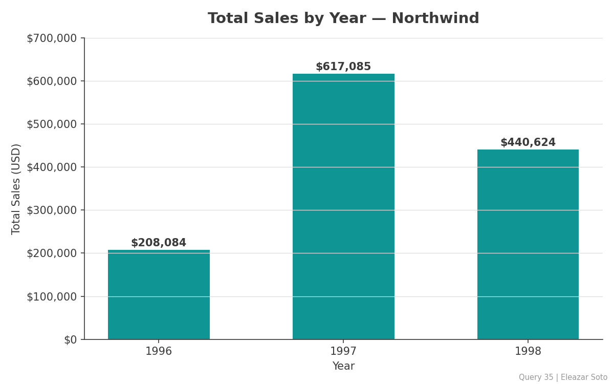
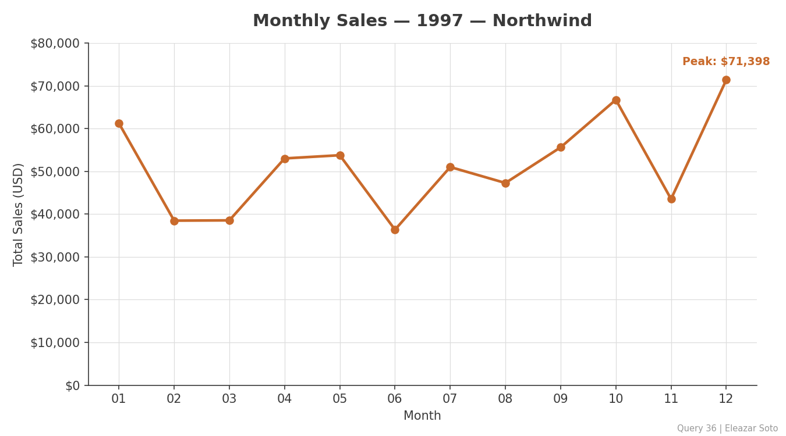
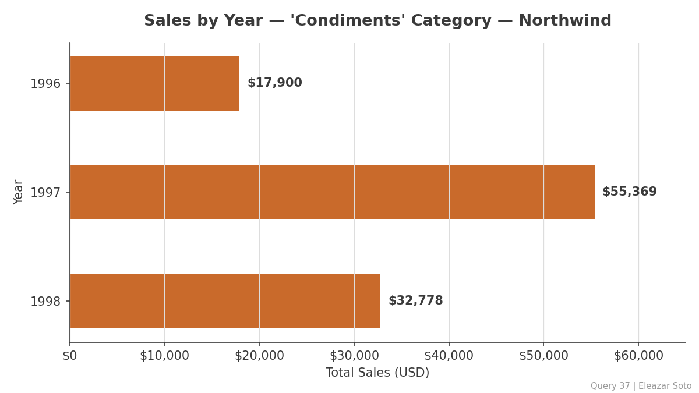
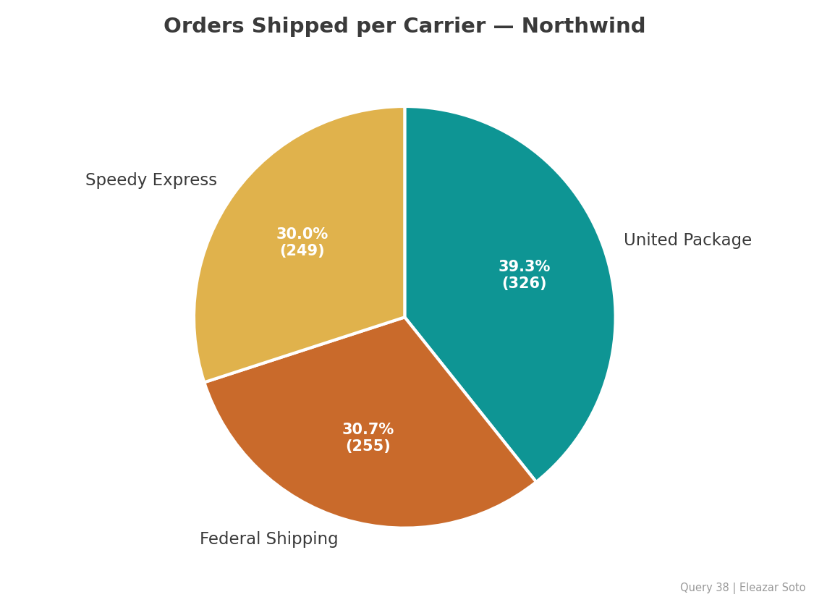
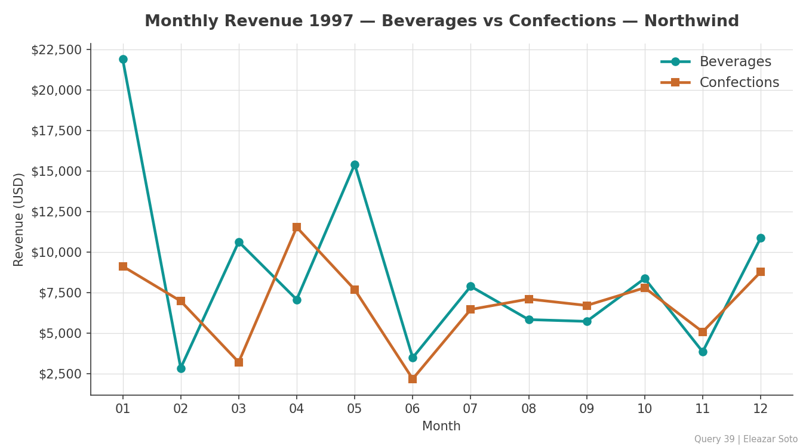

# Northwind Database — SQL Analysis

**Author:** Eleazar Soto · [github.com/eleazarsoto](https://github.com/eleazarsoto)

*[English](#english) | [Español](#español)*

---

## English

### Overview

SQL analysis of the classic **Northwind** database (SQLite): 830 orders, 93 customers, 77 products, and 9 employees of a fictitious food import/export company (1996–1998).

The project covers **39 business questions** organized in 6 levels of increasing depth — from basic filtering to time series with conditional aggregation — plus an Excel report with tabular results and charts.

### Project structure

```
northwind-sql-analysis/
├── README.md
├── northwind_analysis_en.sql        # 39 queries, documented in English
├── northwind_analisis_es.sql        # Same analysis, documented in Spanish
├── Reporte_Northwind.xlsx           # Excel report: results, charts, queries
├── Reporte_Northwind_Graficos.pdf   # PDF export of the Excel charts
├── SQL_Reference_Complete_Eleazar_Soto.pdf   # Personal SQL reference guide
└── charts/                          # Chart images (queries 35–39)
```

### Skills demonstrated

| Level | Topics |
|-------|--------|
| 1 | SELECT, WHERE, LIKE, IN, IS NULL |
| 2 | INNER / LEFT / SELF JOINs, date functions |
| 3 | Scalar subqueries, aggregation with HAVING |
| 4 | Top-N rankings, multi-table business analysis |
| 5 | Date analysis with `strftime()` |
| 6 | Time series, conditional aggregation with `CASE WHEN`, data visualization |

### Selected insights

- **1997 was the peak year** with **$617,085** in revenue — 3x the 1996 total. 1998 reached $440,624 in only five months of data, on pace to beat 1997.
- **December 1997 was the strongest month** ($71,398); June the weakest ($36,363).
- **Shipping is well diversified:** United Package leads with 39.3% of orders (326), followed by Federal Shipping (30.7%) and Speedy Express (30.0%).
- **Beverages revenue is volatile** — from $21,904 (January) to $2,846 (February) — while Confections stays in a stable band, suggesting large one-off beverage orders worth investigating.

### Charts (queries 35–39)

**Total sales by year — column chart**



**Monthly sales, 1997 — line chart**



**'Condiments' category sales by year — bar chart**



**Orders shipped per carrier — pie chart**



**Beverages vs Confections, monthly 1997 — line chart**



### Tools

SQLite · SQLiteViz · Excel · Git/GitHub

---

## Español

### Descripción

Análisis SQL de la base de datos clásica **Northwind** (SQLite): 830 pedidos, 93 clientes, 77 productos y 9 empleados de una empresa ficticia de importación/exportación de alimentos (1996–1998).

El proyecto responde **39 preguntas de negocio** organizadas en 6 niveles de profundidad creciente — desde filtrado básico hasta series de tiempo con agregación condicional — más un reporte en Excel con resultados tabulares y gráficas.

### Estructura del proyecto

```
northwind-sql-analysis/
├── README.md
├── northwind_analysis_en.sql        # 39 consultas, documentadas en inglés
├── northwind_analisis_es.sql        # El mismo análisis, documentado en español
├── Reporte_Northwind.xlsx           # Reporte Excel: resultados, gráficas, consultas
├── Reporte_Northwind_Graficos.pdf   # Exportación PDF de las gráficas del Excel
├── SQL_Reference_Complete_Eleazar_Soto.pdf   # Guía de referencia SQL personal
└── charts/                          # Imágenes de las gráficas (consultas 35–39)
```

### Habilidades demostradas

| Nivel | Temas |
|-------|-------|
| 1 | SELECT, WHERE, LIKE, IN, IS NULL |
| 2 | JOINs (INNER / LEFT / SELF), funciones de fecha |
| 3 | Subconsultas escalares, agregación con HAVING |
| 4 | Rankings top-N, análisis de negocio multi-tabla |
| 5 | Análisis de fechas con `strftime()` |
| 6 | Series de tiempo, agregación condicional con `CASE WHEN`, visualización de datos |

### Hallazgos seleccionados

- **1997 fue el año pico** con **$617,085** de facturación — el triple de 1996. 1998 alcanzó $440,624 en solo cinco meses de datos, con ritmo para superar a 1997.
- **Diciembre de 1997 fue el mes más fuerte** ($71,398); junio el más débil ($36,363).
- **El envío está bien diversificado:** United Package encabeza con el 39.3% de los pedidos (326), seguido de Federal Shipping (30.7%) y Speedy Express (30.0%).
- **La facturación de Beverages es volátil** — de $21,904 (enero) a $2,846 (febrero) — mientras Confections se mantiene en una banda estable, lo que sugiere pedidos grandes puntuales de bebidas que valdría la pena investigar.

### Gráficas (consultas 35–39)

Las cinco gráficas de la sección anterior corresponden a las consultas 35–39: ventas totales por año (columnas), ventas mensuales de 1997 (líneas), categoría 'Condiments' por año (barras), pedidos por transportista (pastel) y comparativo Beverages vs Confections (líneas).

### Herramientas

SQLite · SQLiteViz · Excel · Git/GitHub

---

*Part of my data analytics portfolio — from cultural production management at [Rezzonante Producciones](https://github.com/eleazarsoto) to data-driven decision making.*
